# E-Commerce Platform

(основано на реальных событиях)

## Предыстория

Вы работаете в большом маркетплейсе `Igoroutine Shop`. За хорошую работу вас повысили и расширили зону ответственности, теперь в вашу
юрисдикцию входит платформа электронной коммерции.


Вы собрали функциональные требования и спроектировали два сервиса:

- **Cart** — управление корзиной пользователя
- **Logistics and Order Management System (LOMS)** — логистика и управление заказами


Изначально пользователь добавляет товары в корзину:

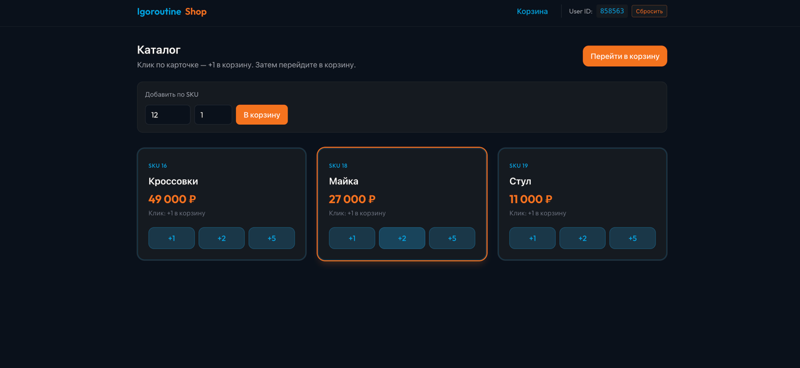

Важно, что при добавлении товара проверяются его существование и наличие на складе:

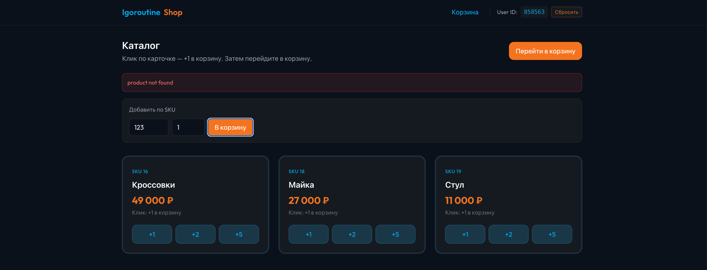

Далее пользователь переходит к оплате:

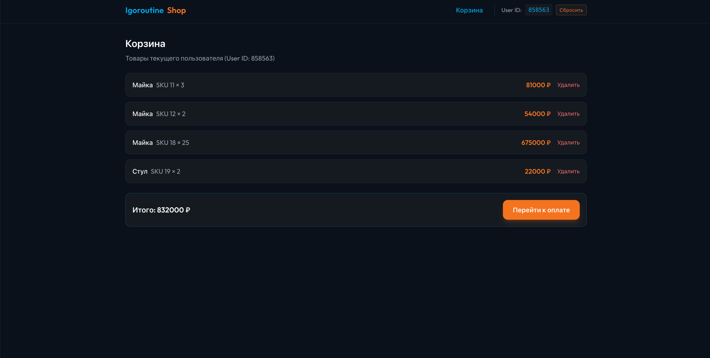

Заказ можно оплатить или отменить:

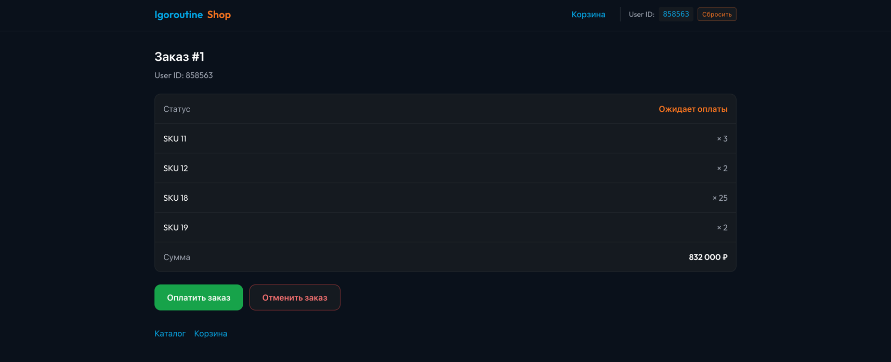

Оплата:
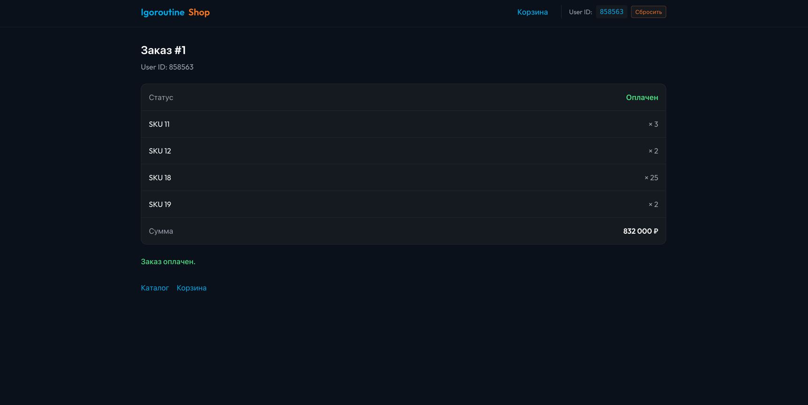

Отмена:
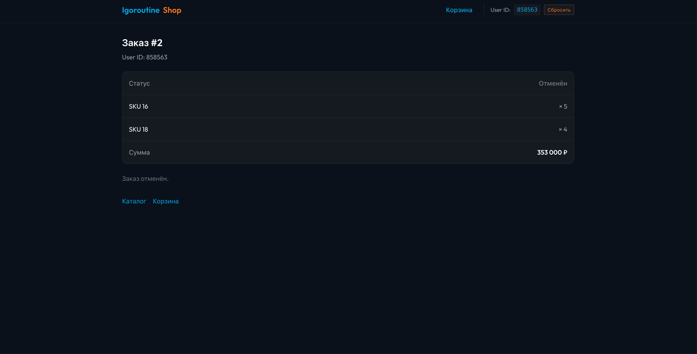


# Часть 1

Как грамотный архитектор, вы решили начать с [UML-диаграмм](https://ru.wikipedia.org/wiki/Диаграмма_(UML)) для основных сценариев.

Добавление товара в корзину:

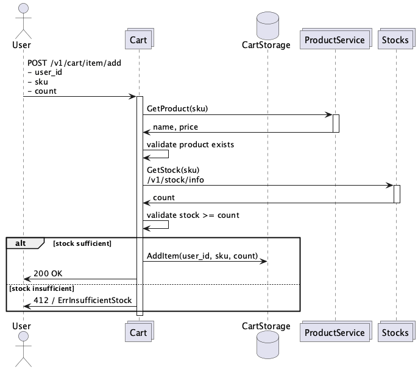

Просмотр корзины

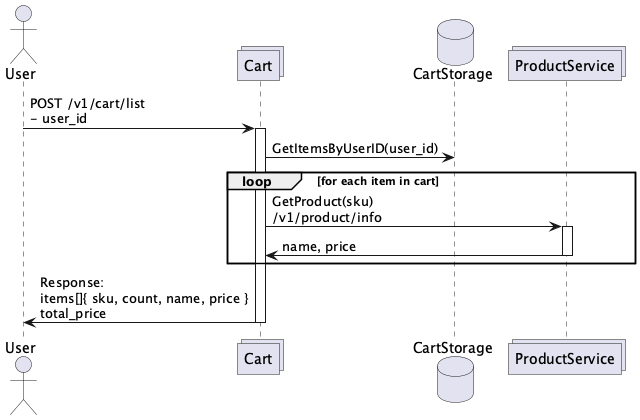

Создание заказа

cart:


loms:

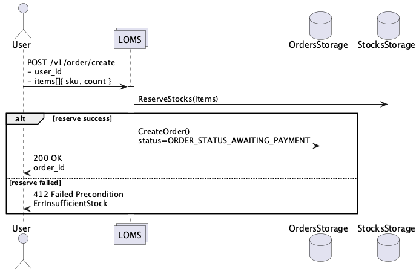

Оплата заказа:

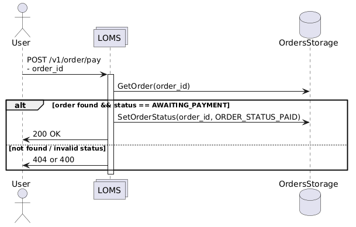

Отмена заказа:

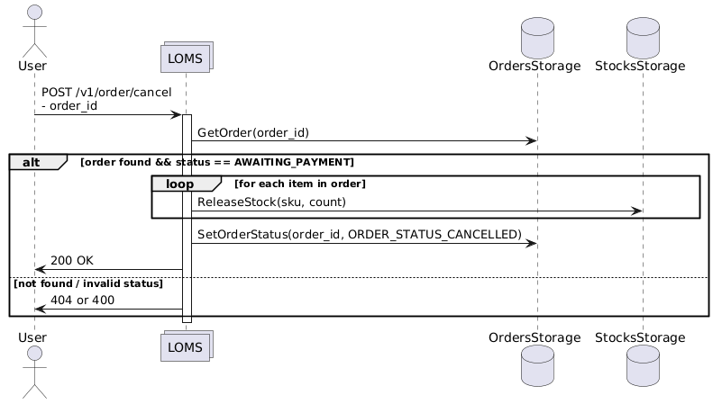

На первом шаге вам необходимо разработать сервисы [loms](./loms) и [cart](./cart), реализовав и протестировав вышеперечисленные сценарии.

Для вашего удобства в шаблоне репозитория лежат заготовки с кодом. Вам даны .proto файлы для сервисов cart и loms.

- [cart.proto](./cart/api/v1/cart.proto) — контракт для работы с корзиной
- [product.proto](./loms/api/product/v1/product.proto) — контракт для работы с продуктами (проверка существования продукта, добавление)
- [stocks.proto](./loms/api/stocks/v1/stocks.proto)  — контракт для получения информации об остатках и управления резервами товаров
- [loms.proto](./loms/api/loms/v1/loms.proto)  — контракт для работы с заказами

> proto контракты можно дополнять, не ломая обратную совместимость

## Пример реализации

Рассмотрим сценарий добавления товара в корзину пользователя.


Изначально создадим клиента из Cart в ProductService (loms):

```go
lomsConn, err := grpc.NewClient(
    cfg.Clients.LOMSGrpcAddr,
    grpc.WithTransportCredentials(insecure.NewCredentials()),
)

if err != nil {
    logger.Fatal("failed to connect to server", zap.Error(err))
}

defer func(conn *grpc.ClientConn) {
    _ = conn.Close()
}(lomsConn)

productClient := productadapter.NewProductClient(
    product.NewProductServiceClient(lomsConn),
)
```

Далее напишем хендлер для добавления товара в cart:

```go
func (s *cartServer) AddItem(ctx context.Context, req *cartpb.AddItemRequest) (*emptypb.Empty, error) {
	if err := req.Validate(); err != nil {
		return nil, status.Errorf(codes.InvalidArgument, "%v", err)
	}

	if err := s.itemService.AddItem(ctx, req.UserId, req.Sku, req.Count); err != nil {
		switch {
		case errors.Is(err, entity.ErrProductNotFound):
			return nil, status.Errorf(codes.NotFound, "product not found")
		case errors.Is(err, entity.ErrInsufficientStock):
			return nil, status.Errorf(codes.FailedPrecondition, "insufficient stock")
		default:
			return nil, status.Errorf(codes.Internal, "%v", err)
		}
	}

	return &emptypb.Empty{}, nil
}
```

Бизнес-логика выглядит следующим образом:

```go
func (s *itemService) AddItem(ctx context.Context, userID int64, sku, count uint32) error {
	_, err := s.productClient.GetProductInfo(ctx, sku)

	if err != nil {
		switch {
		case errors.Is(err, port.ErrProductNotFound):
			return fmt.Errorf("get product info error: %w", entity.ErrProductNotFound)
		default:
			return err
		}
	}

	available, _ := s.lomsClient.GetStocks(ctx, sku)

	if uint64(count) > available {
		return fmt.Errorf("insufficient stock, requested %d, got %d: %w",
			count,
			available,
			entity.ErrInsufficientStock,
		)
	}

	return s.cartRepository.AddItem(ctx, userID, sku, count)
}
```

На текущем этапе мы работаем с in-memory-хранилищем:

```go
type inMemoryRepository struct {
	mx    sync.RWMutex
	items map[int64][]entity.OrderItem
}

func NewInMemoryRepository() *inMemoryRepository {
	return &inMemoryRepository{
		items: make(map[int64][]entity.OrderItem),
	}
}
```

> При внимательном рассмотрении можно заметить, что in-memory хранилище не обеспечивает персистентность данных и полноценные транзакционные гарантии.
> При перезапуске данные теряются. Более того, если выполнение запроса будет прервано, в хранилище может появиться неконсистентное состояние.
> Мы исправим это в следующих частях.

## Тестирование

В этом задании вам необходимо сгенерировать моки:

Пример:
```go
//go:generate mockgen -source=cart.go -destination=mocks/cart_mocks.go -package=mocks
type (
	ItemService interface {
		AddItem(ctx context.Context, userID int64, sku, count uint32) error
		DeleteItem(ctx context.Context, userID int64, sku uint32) error
	}

	CartService interface {
		ListCart(ctx context.Context, userID int64) (items []entity.OrderItem, totalPrice uint32, err error)
		ClearCart(ctx context.Context, userID int64) error
		CheckoutCart(ctx context.Context, userID int64) (orderID int64, err error)
	}
)
```

После чего написать юнит-тесты, желательно покрыть тестами всё, в CI проверяется покрытие кода > 60%. Добавление сгенерированных моков в репозиторий считается ошибкой,
необходимо генерировать их (`task generate` запускает `go generate`).

Более того, помимо ваших тестов решение будет проверяться интеграционными тестами курса. [grpc_test](./integration-tests/grpc_test) и [grpc_gateway_test.go](./integration-tests/grpc_gateway_test.go)
независимо от других частей проверяют первую часть задания.

# Часть 2

Как обсуждалось, in-memory хранилище имеет ряд существенных недостатков. В этой части вам необходимо интегрировать
ваши сервисы с СУБД [PostgreSQL](https://www.postgresql.org/). Для начала стоит спроектировать архитектуру базы данных и научиться
применять её с помощью миграций, в этом задании рекомендуется использовать [goose](https://github.com/pressly/goose).

```go
var embedMigrations embed.FS

func SetupPostgres(pool *pgxpool.Pool, logger *zap.Logger) {
	goose.SetBaseFS(embedMigrations)
	if err := goose.SetDialect("postgres"); err != nil {
		logger.Error("can not set dialect in goose", zap.Error(err))
		os.Exit(-1)
	}

	db := stdlib.OpenDBFromPool(pool)
	if err := goose.Up(db, "migrations"); err != nil {
		logger.Error("can not setup migrations", zap.Error(err))
		os.Exit(-1)
	}
}
```

```sql
-- +goose Up
-- +goose StatementBegin
CREATE SCHEMA IF NOT EXISTS loms;

CREATE TYPE loms.order_status AS ENUM ('new', 'awaiting payment', 'failed', 'paid', 'cancelled');

...
```

Далее необходимо поддержать SQL-запросы к базе данных. Для генерации кода на Go рекомендуется использовать [sqlc](https://github.com/sqlc-dev/sqlc).

```sql
-- name: InsertOrder :one
INSERT INTO loms.orders (id, user_id, status)
VALUES (sqlc.arg(id), sqlc.arg(user_id), sqlc.arg(status)::loms.order_status)
RETURNING id, user_id, status, created_at, updated_at;
```

```go
const insertOrder = `-- name: InsertOrder :one
INSERT INTO loms.orders (id, user_id, status)
VALUES ($1, $2, $3::loms.order_status)
RETURNING id, user_id, status, created_at, updated_at
`

type InsertOrderParams struct {
	ID     int64           `json:"id"`
	UserID int64           `json:"user_id"`
	Status LomsOrderStatus `json:"status"`
}

func (q *Queries) InsertOrder(ctx context.Context, arg InsertOrderParams) (LomsOrder, error) {
	row := q.db.QueryRow(ctx, insertOrder, arg.ID, arg.UserID, arg.Status)
	var i LomsOrder
	err := row.Scan(
		&i.ID,
		&i.UserID,
		&i.Status,
		&i.CreatedAt,
		&i.UpdatedAt,
	)
	return i, err
}
```

Для проверки корректности вашего решения используются тесты в [db_test.go](./integration-tests/db_test.go). Например, поднимаются
два экземпляра приложения, чтобы полноценно проверить различные сценарии использования:

```yaml
  loms:
    image: loms
    hostname: loms
    build:
      context: .
      dockerfile: ./loms/Dockerfile
    restart: unless-stopped
    environment:
      ...
      postgres:
        condition: service_healthy
      notifications:
        condition: service_started

  loms-2:
    image: loms
    hostname: loms-2
    build:
      context: .
      dockerfile: ./loms/Dockerfile
    restart: unless-stopped
    environment:
      ...
    depends_on:
      postgres:
        condition: service_healthy
      notifications:
        condition: service_started
      loms:
        condition: service_started
```

# Часть 3

В этой части к вам внезапно пришли заказчики и объявили, что нужно срочно интегрироваться с новым мессенджером, чтобы присылать туда уведомления
о статусах заказа. Для этого появился сервис `notifications`, вам предстоит самим разработать для него API.
На текущем этапе ваш сервис должен просто пересылать статус заказа по URL'у из переменной окружения:

```go
CallbackAddr string `env:"CALLBACK_ADDR" envDefault:""` // config

...

callbackAddr := strings.TrimSpace(n.cfg.Clients.CallbackAddr)

type callbackPayload struct {
	UserID  int64  `json:"user_id"`
	OrderID int64  `json:"order_id"`
	Status  string `json:"status"`
}

if callbackAddr == "" {
	return &emptypb.Empty{}, nil
}
```

Однако в `loms` вы бы не хотели, чтобы создание заказов зависело от скорости ответа внешнего сервиса. Поэтому необходимо решить эту проблему,
присылая уведомления в `notifications` асинхронно. Для решения этой задачи предлагается поддержать архитектурный паттерн `outbox`.


Для проверки корректности вашего решения используются тесты в [notifications_test.go](./integration-tests/notifications_test.go). Они в том числе умеют эмулировать
долгий ответ от внешней системы.

Параметры для outbox задаются в переменных окружения:

```yaml
OUTBOX_WORKERS: "1"
OUTBOX_BATCH_SIZE: "10"
OUTBOX_FETCH_PERIOD: "200ms"
OUTBOX_IN_PROGRESS_TTL: "10s"
```


## Локальный запуск

- `task update hw=hw1` — скачивает docker-compose файлы для тестирования и локального запуска
- `task frontend` — запускает frontend, перед выполнением необходимо установить [npm](https://docs.npmjs.com/downloading-and-installing-node-js-and-npm)
- `task backend` — запускает backend
- На Windows без WSL многое может не работать


## Особенности реализации
* В этом задании можно не заводить отдельные структуры под слой repository, можно использовать общий entity слой.
* **Настоятельно** рекомендуется писать комментарии для проверяющих, чтобы обосновать свою точку зрения в выборе
того или иного компромисса (trade-off’а).
* Крайне рекомендуется осознать механизм работы интеграционных тестов


## Сдача
* Открыть pull request из ветки `hw1` в ветку `main` **вашего репозитория**, название ветки **важно**
* В описании PR заполнить количество часов, которые вы потратили на это задание
* Не стоит изменять файлы в директории [.github](.github)

## Скрипты
Для запуска скриптов на курсе необходимо установить [go-task](https://taskfile.dev/docs/installation)

`go install github.com/go-task/task/v3/cmd/task@latest`

Перед выполнением задания не забудьте выполнить:

```bash 
task update hw=hw1
```

При возникновении ошибок с `task update` ознакомьтесь в [гайдом](https://github.com/igoroutine-courses/guide.github_scripts)

Запустить линтер:
```bash 
task lint
```

Запустить тесты:
```bash
task test
``` 

Обновить файлы задания
```bash
task update hw=hw1
```

Принудительно обновить файлы задания
```bash
task force-update hw=hw1
```

Запустить генерацию кода:
```bash
task generate
```

Запустить backend в docker:
```bash
task backend
```

Запустить frontend в docker:
```bash
task frontend
```

Скрипты работают на Windows, однако при разработке на этой операционной системе
рекомендуется использовать [WSL](https://learn.microsoft.com/en-us/windows/wsl/install)
